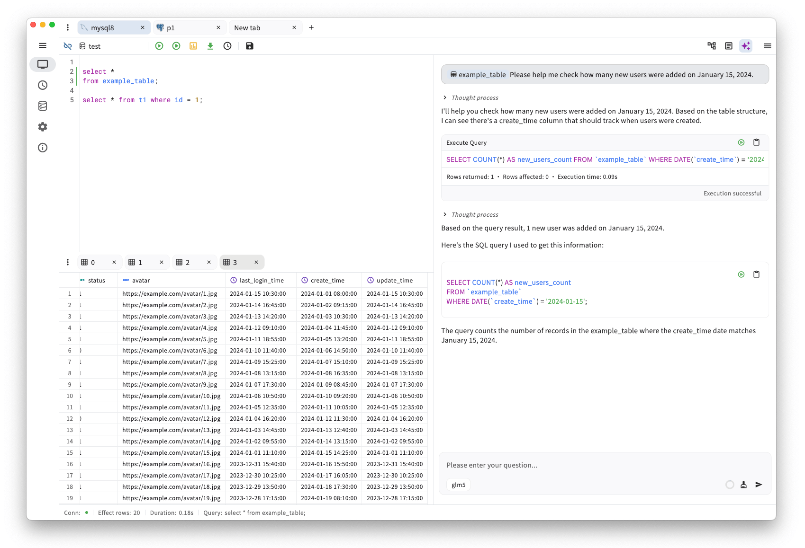

  

openhare 是一款 AI 驱动的跨平台桌面 SQL 客户端，支持多数据库连接，适用于日常开发、数据分析与 DBA 管理等工作场景。

  
  
  
  
  
  
  

  

  <a href="./README.md">English</a> | <strong>简体中文</strong>

## 核心特性
- **AI 智能辅助**：帮助你编写、优化并理解 SQL 查询。
- **跨平台支持**：无缝运行于 Windows、macOS 和 Linux。
- **完全开源**：基于 [Apache License 2.0](./LICENSE) 开源，透明且社区驱动。
- **简洁直观的界面**：现代化 UI，聚焦效率与易用性。
- **多数据库支持**：轻松连接并管理多种 SQL 数据库。

## 技术框架
1. 应用层： [Flutter](https://flutter.dev/), [flutter_rust_bridge](https://github.com/fzyzcjy/flutter_rust_bridge)
2. 状态管理： [Riverpod](https://riverpod.dev/), [GoRouter](https://pub.dev/packages/go_router)
3. UI： [SQL Editor](https://github.com/reqable/re-editor), [HugeIcons](https://github.com/hugeicons/hugeicons-flutter), [Window Manager](https://github.com/leanflutter/window_manager)
4. 存储： [ObjectBox](https://objectbox.io/)
5. 数据库驱动：
   - [MySQL](https://github.com/blackbeam/mysql_async)，基于 Rust + flutter_rust_bridge；
   - [Postgresql](https://github.com/isoos/postgresql-dart)，纯 Dart 实现；
   - [SQL Server](https://github.com/prisma/tiberius)，基于 Rust + flutter_rust_bridge；
   - [SQLite](https://github.com/rusqlite/rusqlite)，基于 Rust + flutter_rust_bridge；
   - [Oracle](https://github.com/sijms/go-ora)，基于 Go + Flutter FFI 插件。

## Star 历史

